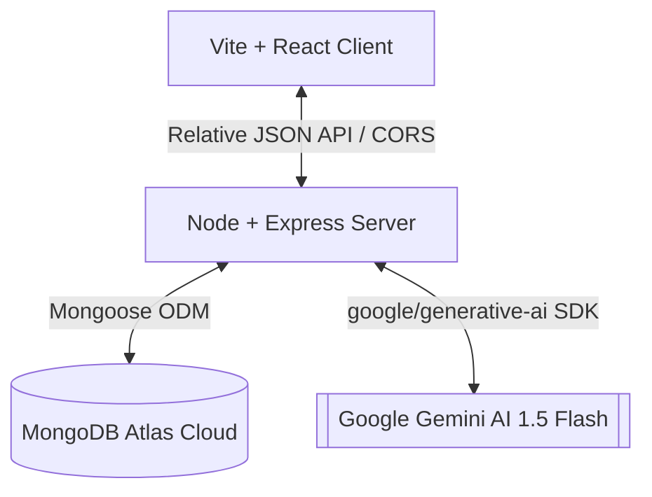

# AI — Team Task Manager ⚡

An **AI-Assisted Productivity & Team Collaboration Platform** that elevates traditional task coordination into a smart, self-optimizing work engine. Built using the **MERN Stack** (MongoDB, Express, React, Node.js) and powered by **Google Gemini 1.5 Flash**.

---

## 🚀 The Core Product Concept
This application is designed around a **Dual-Mode Operational Engine**, solving the friction between manual micromanagement and automated scheduling:

1. **Normal Mode**: Traditional task management. Users manually create tasks, assign roles, designate due dates, drag-and-drop statuses, and view direct charts. Perfect for total manual control.
2. **AI Smart Mode**: Gemini-powered productivity assistant. Features smart scheduling, dynamic checklists, estimated duration hours, risk level classification, deadline feasibility analysis, and active team workload balancing dashboards.

---

## 🛠️ Tech Stack & Advanced Libraries
* **Backend**: Node.js, Express, Mongoose (MongoDB Atlas), JWT (Authentication), `@google/generative-ai` (Gemini Layer), `node-cron`
* **Frontend**: React (Vite-scaffolded), **Vanilla CSS** (Custom theme, Obsidian palettes, Glassmorphism, animated glow effects), **Recharts** (Interactive Workload & Sprint metrics), **Framer Motion** (Subtle UI animations), **Lucide React** (Clean developer icons)

---

## 📊 System Architecture



In production, the architecture compiles into a **single unified MERN process**: the Express server hosts the static compiled React build. This avoids separate hosting cold starts, simplifies cookies/headers, and prevents CORS cross-origin configuration errors.

---

## ⚙️ Environment Configuration

Create a `.env` file at the root directory (or inside `/backend` and `/frontend` respectively):

```env
# MERN Server configurations
PORT=5000
NODE_ENV=production

# Database Configuration
MONGO_URI=mongodb+srv://<username>:<password>@cluster.mongodb.net/taskmanager?retryWrites=true&w=majority

# Session Key Security
JWT_SECRET=your_jwt_signing_secret_key_change_me_in_production
JWT_EXPIRE=30d

# Google Gemini API Key
# Get a key from: https://aistudio.google.com/
GEMINI_API_KEY=your_gemini_api_key_here
```

*Note: For Vite frontend during local development, config is set in `frontend/.env` as `VITE_API_URL=http://localhost:5000/api`.*

---

## 🏃 Local Setup & Installation

### 1. Pre-requisites
Ensure you have [Node.js (v18+)](https://nodejs.org/) installed.

### 2. Install Monorepo Dependencies
Run the command below in the root folder to download and configure packages for the root, backend, and frontend at once:
```bash
npm run install-all
```

### 3. Run Local Dev Server
Start both servers concurrently:
```bash
npm run dev
```
* The React frontend will run on `http://localhost:5173`
* The Express server will run on `http://localhost:5000`

---

## ☁️ Deployment Ready for Render (Single-Service)

To deploy the entire monorepo as a **single Render Web Service** (extremely resource efficient!):

1. Log into your [Render Dashboard](https://dashboard.render.com/) and create a new **Web Service**.
2. Connect your Git repository.
3. Configure the following build & start settings:
   * **Root Directory**: Leave blank (monorepo root)
   * **Runtime**: `Node`
   * **Build Command**: `npm run install-all && npm run build`
   * **Start Command**: `npm run start`
4. Add your Environment Variables (`MONGO_URI`, `JWT_SECRET`, `GEMINI_API_KEY`) under Render's **Environment** tab.
5. Render will build the Vite assets, save them inside the backend static hosting directory, and boot the server. Your app will be live on a single URL!

---

## 💎 The Recruiter Demo Strategy

If presenting this project in a hiring review or demo video, follow this flow to guarantee high scores:

1. **Demonstrate Normal Mode**:
   * Create a standard task (e.g. *"Build profile settings page"*).
   * Assign a member, manually select standard due date, and save.
   * Drag-and-drop the card between Board columns showing standard CRUD responses.
2. **Switch to AI Smart Mode**:
   * Turn the mode toggle to **AI Smart Mode**. Watch the borders glow with neon violet ambient filters, indicating the active AI assistant.
3. **Execute Natural Language parsing**:
   * Type in the AI search bar: *"Implement stripe payment checkout by next Friday with high priority for Alice"*.
   * Hit enter. Gemini will instantly parse the language, calculate duration, establish priority, generate a 5-step checklist, and analyze feasibility. 
   * Review and click **Accept and Save**.
4. **Inspect checklist progression**:
   * Open the new card and check off subtasks. Watch the smart progress bar update live.
5. **Show the AI Dashboard**:
   * Click **AI Workload Planner**. Show the workload capacity balancing graphs and read active Agile coach suggestions pointing out bottlenecks.
